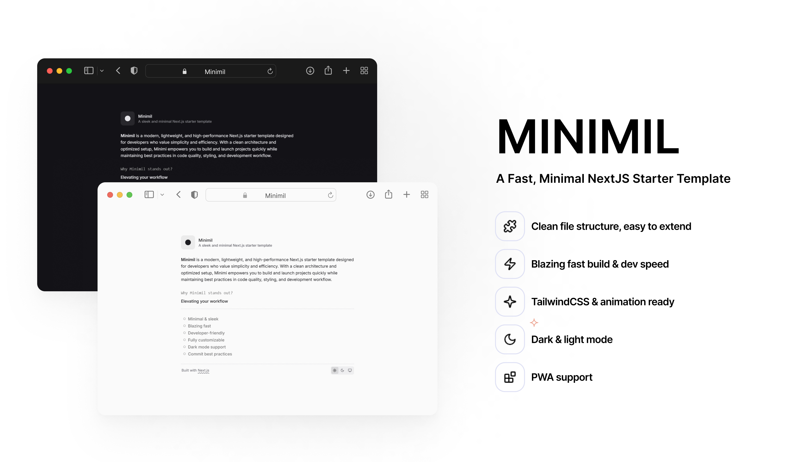
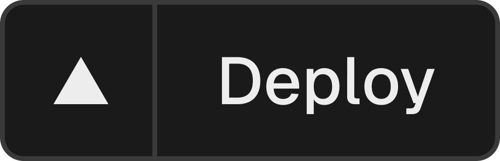

<p align="center">
	
	<h4 align="center">Minimil</h4>
  <p align="center">Next.js Starter Template</p>
</p>

<p align="center">
  <picture>
    <source media="(prefers-color-scheme: dark)" srcset="https://res.cloudinary.com/ddkhkc3uu/image/upload/v1744549191/github-repo-icons/squiggly-line-light.svg">
    
  </picture>
</p>

<p align="center">
	<a href="https://minimil.vercel.app/">Live demo</a>
</p>



<p align="center">
  <a href="https://vercel.com/new/clone?repository-url=https://github.com/tanlucvn/minimil&env=NEXT_PUBLIC_SITE_URL&project-name=minimil&repository-name=minimil">
    
  </a>
</p>

<p align="center">
  <picture>
    <source media="(prefers-color-scheme: dark)" srcset="https://res.cloudinary.com/ddkhkc3uu/image/upload/v1744549191/github-repo-icons/squiggly-line-light.svg">
    
  </picture>
</p>

<div align="center">
  <picture>
    <source media="(prefers-color-scheme: dark)" srcset="https://res.cloudinary.com/ddkhkc3uu/image/upload/v1744550370/github-repo-icons/sparkle-light-border.svg">
    
  </picture>

  <h4>Features</h4>
</div>

**Clean structure** – easy to extend and scale  
**Blazing fast** – optimized build and dev performance  
**Tailwind CSS & animation ready** – with `tailwindcss-animate` and `framer-motion`  
**Dark & light mode** – powered by `next-themes`  
**PWA support** – via [`@serwist/next`](https://www.npmjs.com/package/@serwist/next)  
**Developer-friendly** – commit linting, formatting, and type checking baked in  
**Strict code quality** – powered by [`biome`](https://biomejs.dev/)

<p align="center">
  <picture>
    <source media="(prefers-color-scheme: dark)" srcset="https://res.cloudinary.com/ddkhkc3uu/image/upload/v1744549191/github-repo-icons/squiggly-line-light.svg">
    
  </picture>
</p>

<div align="center">
  <picture>
    <source media="(prefers-color-scheme: dark)" srcset="https://res.cloudinary.com/ddkhkc3uu/image/upload/v1744550826/github-repo-icons/folder-light.svg">
    
  </picture>

  <h4>Folder Structures</h4>
</div>

```bash
├── public/             # Static assets
├── src/                # App source code
│   ├── app/            # Next.js app directory
│   ├── components/     # Reusable UI components
│   ├── lib/            # Utility functions & configs
├── .husky/             # Git hooks
├── biome.json          # BiomeJS config
├── tailwind.config.ts  # TailwindCSS config
├── postcss.config.js
└── README.md           
```

<p align="center">
  <picture>
    <source media="(prefers-color-scheme: dark)" srcset="https://res.cloudinary.com/ddkhkc3uu/image/upload/v1744549191/github-repo-icons/squiggly-line-light.svg">
    
  </picture>
</p>

<div align="center">
  <picture>
    <source media="(prefers-color-scheme: dark)" srcset="https://res.cloudinary.com/ddkhkc3uu/image/upload/v1744550896/github-repo-icons/download-light.svg">
    
  </picture>

  <h4>Getting Started</h4>
</div>

```bash
# Clone the repo
git clone https://github.com/tanlucvn/minimil

# Install dependencies
pnpm install

# Start development server
pnpm dev
```